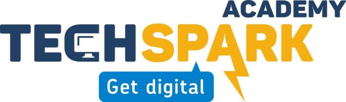
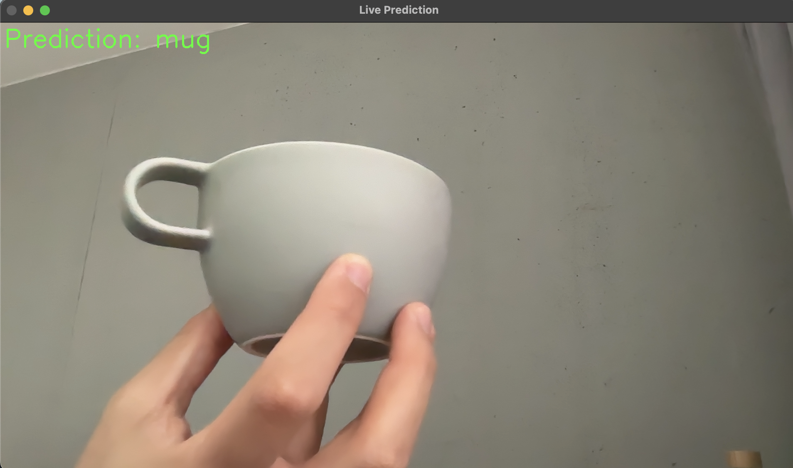

<p align="right">
  <b>Powered by      </b>
</p>

<p align="right">
  
</p>


# Image Recognition Project

In this fun and beginner-friendly machine learning project, you'll build your very own object recognition system using Python! The goal? To teach a computer how to recognize everyday classroom items like pens, glasses, notebooks, erasers, and more—just by showing them to your webcam!

## Project Overview
In this project, you will:

 - Collect images of objects using your webcam: use your webcam to snap pictures of objects around you. You'll collect 20–30 photos of each item from different angles, lighting conditions, and backgrounds to help the computer learn better.
 - Train a machine learning model to recognize them: feed your image data into a simple model. You’ll teach your computer to spot patterns in the images—like shape, color, and size.
 - Test the model in real-time during a live demo: connect your webcam and run a live prediction script! Hold up an object, and your model will try to guess what it is—in real time! If there's no recognizable object, it will say "No object."
<div align="center">
    
    
</div>
##  Files Description

| File             | Description |
|------------------|-------------|
| `save_images.py` | Code to take pictures of classroom objects using OpenCV (you'll need to complete the TODOs)
| `train_model.py` | Code to train a simple machine learning model using TensorFlow (you'll need to complete the TODOs)
| `preprocess.py` | Processes the images by resizing and preparing them for training
| `predict_webcam.py` | Uses your trained model to recognize objects in real time. |


##  Your Tasks
You'll need to complete the TODOs in two main files:
 - save_images_student.py - Help the program capture and save images of objects
 - train_model_student.py - Build a neural network model that can learn to recognize objects

##  Clone this Project
To download all the code and files from this project, simply run:
```bash
git clone https://github.com/
```
This will create a new folder with all the files you need — including:
 - Python scripts to collect and preprocess images
 - Training and prediction scripts
 - Sample code to modify
 - The README file you're reading now!
   
##  Project Steps
1. Install requirements
```bash
pip install -r requirements.txt
```

2. Complete the TODOs in save_images_student.py, then run the following to collect training images :
```bash
python save_images_student.py
```
Create 20-30 images per object (pen, glasses, eraser, notebook, etc.).

3. Preprocess the images
This step resizes all images to a fixed size and saves them in a format the model can use:
```bash
python preprocess.py
```
This will create a file called dataset.pkl which contains the image data and labels.

4. Complete the TODOs in train_model_student.py, then run the following to train your model:
```bash
python train_model_student.py
```
This script will process the images and train a model called object_detector.h5.

5. Run real-time prediction!
```bash
python predict_webcam.py
```
Try holding up different objects in front of the webcam. The program will tell you what it sees!

## Clean-Up Tip
If the model isn't working well, you can delete the object_detector.h5 file and try collecting more images or re-training.

## Learning Goals
Understand how machines can learn to see like humans
Learn basic Python scripting and libraries like OpenCV and TensorFlow
Experience the joy of coding and seeing results in real-time!


## Helpful Hints

Make sure your webcam is working before starting
Take pictures with different backgrounds and lighting
The more varied your training images, the better your model will recognize objects!
